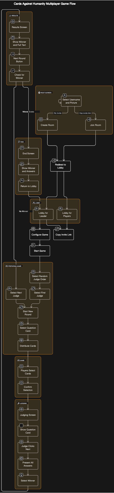

# Cyber Chaos Cards - CCC

A Cards against Humanity clone online game.

## Project Structure

This project is divided into two primary sections:

- `client`: This is the frontend of the application powered by Next.js.
- `server`: This is the backend of the application handling API and data-related operations.

Additionally, there's a `types` folder which contains shared types and utilities that both the `client` and `server` might need access to.


## Pre requisites

Before starting, ensure you have the following installed:

1. [NodeJS](https://nodejs.org/en/download/) (version 20 or higher)
2. [pnpm](https://pnpm.io/installation) (Performance-focused package manager)

## Setting up the Project

1. **Clone the Repository**

   Use the following command to clone the repository:

   ```bash
   git clone https://github.com/IgorBayerl/CCC-Cards-Game.git
   ```

2. **Install Dependencies**

   After cloning, navigate to the project directory and install the dependencies using pnpm:

   ```bash
   pnpm install
   ```

3. **Start the Development Servers**

   To start the development servers:

   - For both `client` and `server`:

     ```bash
     pnpm dev
     ```

   - For only the `server`:

     ```bash
     pnpm dev-server
     ```

   - For only the `client`:

     ```bash
     pnpm dev-client
     ```


## Docker

### Development

To run the application in a development environment using Docker, follow these steps:

1. **Ensure Docker is Installed**

   Before proceeding, make sure Docker is installed on your machine. You can download it from [Docker's official website](https://www.docker.com/get-started).

2. **Start the Development Environment**

   Use the following command in the root of the project directory to start the development environment:

   ```bash
   docker-compose -f docker-compose.yaml up --build
   ```

   This command builds and starts both the `client` and `server` services as defined in `docker-compose.yaml`. It mounts the source code into the container to enable live reloading, so any changes you make to the source code will automatically reflect in the running containers.

### Production

To run the application in a production environment using Docker, you will use a different Docker Compose file that is optimized for production:

1. **Ensure Docker is Installed**

   If not already done, make sure Docker is installed on your machine.

2. **Start the Production Environment**

   Use the following command in the root of the project directory to start the production environment:

   ```bash
   docker-compose -f docker-compose.prod.yaml up --build
   ```

   This command uses `docker-compose.prod.yaml`, which is configured to build and run the `client` and `server` using their respective production Dockerfiles (`Dockerfile.prod`). Unlike the development environment, the production setup does not mount the source code into the container. Instead, it builds static assets and runs the optimized version of your application.

**Note:** It's important to ensure that your production Dockerfiles (`Dockerfile.prod` for both client and server) are properly configured to build your application for production. This includes installing dependencies, building your Next.js application for the client, and setting up any necessary production configurations for your server.

---

### Additional Notes

- **Docker Compose Files**: The project includes two Docker Compose files:
  - `docker-compose.yaml` for development.
  - `docker-compose.prod.yaml` for production.
- **Live Reloading**: In development, the application is set up to support live reloading. This means you can edit your code, and the changes will automatically reflect in the running containers without needing to rebuild them.


---
**Happy coding!** 


## Game Flow Diagram


